# Full System Documentation — VentureLedger Exchange (EscrowHub)

This is the master entry document for understanding and recreating the project.

## Included documents
1. **System blueprint**: `PROJECT_SYSTEM_BLUEPRINT.md`
2. **Role and scenario playbook**: `ROLE_AND_SCENARIO_PLAYBOOK.md`
3. **Every screen/tab/button map**: `SCREEN_TAB_BUTTON_FUNCTIONALITY.md`
4. **API + data flow reference**: `API_AND_DATA_FLOW_REFERENCE.md`
5. **Rebuild from scratch guide**: `REPLICATION_FROM_SCRATCH_GUIDE.md`

---

## Quick understanding in 90 seconds
- Entrepreneurs submit startup proposals.
- Admin approves proposals.
- Investors browse approved opportunities and signal interest.
- Accepted signals unlock chat.
- Investors invest via virtual escrow ledger or Stripe.
- Admin releases/refunds funds based on milestones/disputes.
- Wallet and escrow states are derived from transaction history.

---

## End-to-end flow diagram

```mermaid
flowchart LR
  E[Entrepreneur registers] --> P[Submit proposal: pending]
  P --> A[Admin reviews]
  A -->|Approve| AP[Proposal approved]
  AP --> I[Investor browses and signals interest]
  I --> S[Signal accepted by entrepreneur]
  S --> C[Chat room active]
  C --> INV[Investor invests]
  INV --> ESC[Escrow ledger updated]
  ESC --> ADM[Admin resolves release/refund]
  ADM --> OUT[Final balances and history visible to both parties]
```

---

## Backend application map
- `accounts`: user roles + auth profile + wallet balance endpoint
- `marketplace`: proposals/signals/transactions/escrow summary
- `messaging`: chat rooms, messages, unread notifications
- `payments`: Stripe intents, payment statuses, webhook sync

---

## Frontend application map
- Single app state machine in `src/App.tsx`
- Role-aware views: entrepreneur, investor, admin
- Chat modules: `ChatListPage`, `ChatWindow`
- Payment module: `StripeEscrowCheckout`
- API and validation: `src/lib/api.ts`, `validation.ts`

---

## High-priority replication notes
1. Keep strict role checks server-side.
2. Keep standardized list responses (`data`, `count`, `next`, `previous`).
3. Maintain escrow as a ledger computation (never hardcode balances).
4. Implement payment-webhook idempotency.
5. Convert local-only admin/profile toggles into API-backed audited operations.

---

## Proposed reading path for implementers
- Product owner / analyst: Blueprint -> Role Playbook
- UI engineer: Screen/Button map -> API reference
- Backend engineer: API/Data flow -> Replication guide
- Architect / lead: all docs + known implementation nuances
